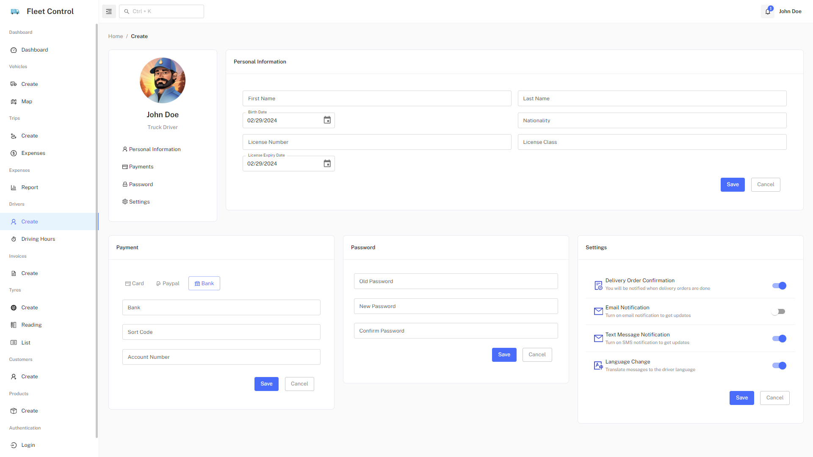

<h1 align="center">Fleet Control</h1>

<p align="center">
  <a href="#-tecnologias">Tecnologias</a>&nbsp;&nbsp;&nbsp;|&nbsp;&nbsp;&nbsp;
  <a href="#-projeto">Projeto</a>&nbsp;&nbsp;&nbsp;|&nbsp;&nbsp;&nbsp;
  <a href="#-layout">Layout</a>&nbsp;&nbsp;&nbsp;|&nbsp;&nbsp;&nbsp;
  <a href="#-licença">Licença</a>
</p>


<br>

<p align="center">
  
</p>

## 🚀 Tecnologias

 
 

 
        

## 💻 Projeto

**Uma aplicação front-end para controle de frotas.** Oferece telas das funcionalidades de cadastro de motoristas, veículos, viagens, despesas de viagens, pneus, notas fiscais, produtos, peças, serviços, ordens de serviço e clientes. É possível listar e editar os registros inseridos na aplicação.

## 🔖 Layout

Para implementação das funcionalidades apresento algumas das páginas desenvolvidas:

### 1. Cadastro de Despesa de Viagem
Permite inserir despesas de viagens classificadas por categoria.
<p align="center">
  
</p>

### 2. Cadastro de Ordem de Serviço
Permite inserir ordend de serviço de manutenção dos veículos da frota com inclusão de pe;cas e serviços a serem realizados.
<p align="center">
  
</p>

### 3. Cadastro de Pneu
Cadastro de pneus dos veículos com registro de posição de montagem.
<p align="center">
  
</p>

### 4. Cadastro de Desgaste de Pneu
Registro da condição de desgaste do pneu para controle de vida útil.
<p align="center">
  
</p>

### 5. Cadastro de Nota Fiscal
Cadastro de nota fiscal contendo cliente de origem e destino, produtos e valores.
<p align="center">
  
</p>

### 6. Lista de Ordens de Serviço
Exibe as ordens de serviço para manutenção dos veículos.
<p align="center">
  
</p>

### 6. Lista de Desgaste de Pneu
Exibe os registros realizados com medição do desgaste do pneu.
<p align="center">
  
</p>

## 🏃 Iniciando o Projeto
Primeiro clone este repositório remoto em sua máquina local:

[git@github.com:denisonkolling/fleet-control-react.git](https://github.com/denisonkolling/fleet-control-react.git)

Lembre-se de adicionar as dependências do projeto:

```bash
npm install
# ou
yarn install
```

Inicie o servidor de desenvolvimento:
```bash
npm run dev
# ou
yarn run dev
```

Acesse [http://localhost:5173/](http://localhost:5173/) com seu navegador para acessar a aplicação.

## 💹 Melhorias em Desenvolvimento

Cronograma de melhorias e desenvolvimento de novas funcionalidades da aplicação:

⏳ - Atualizar design dos cards em listagem de ordens de serviço.<br/>
🧱 - Alterar inserção de serviços e peças na criação de ordens de serviço.<br/>
🌍 - Criar página de mapa com posicionamento do rastreamento de veículos.<br/>

## 📝 Licença

Esse projeto está sob a licença MIT.

---